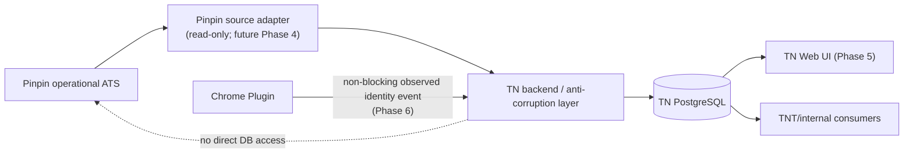
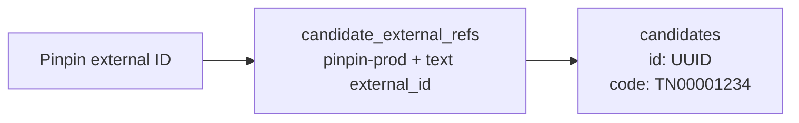
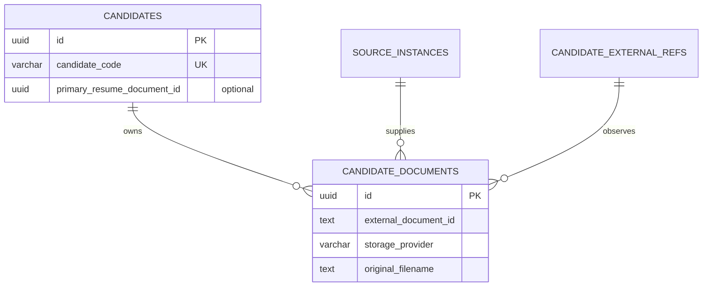
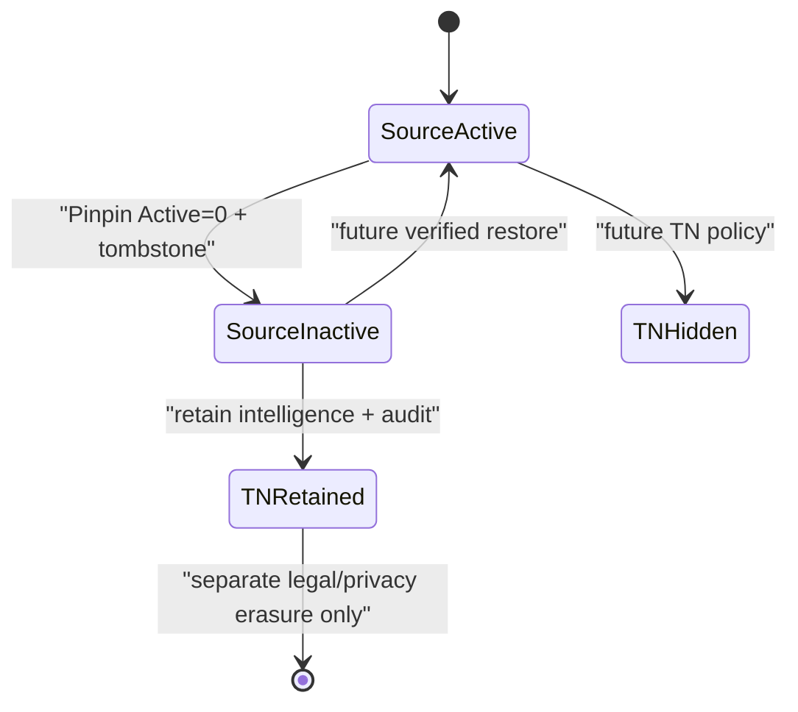
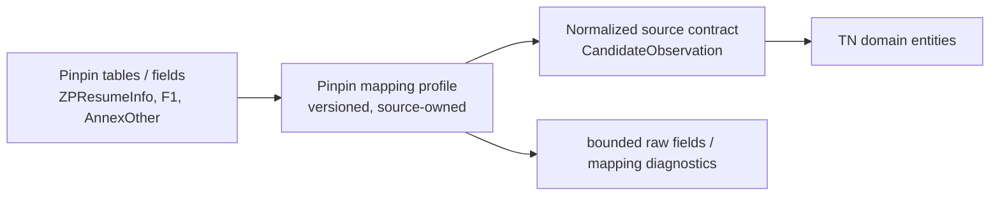
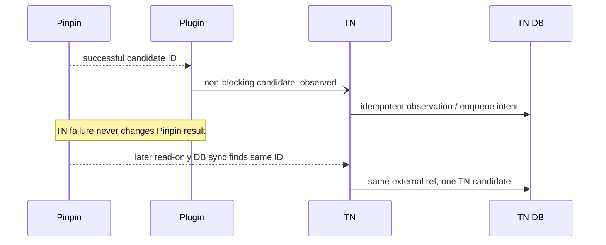
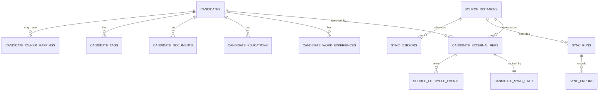

# Talent Nexus Data Model & API Contract

> Phase 2 — design only  
> Status: complete design; no database, API, source adapter, migration, plugin, VPS, or production change was made.  
> Source of truth: Phase 1A, Phase 1B-1, and Phase 1B-2 controlled-verification reports. Where they conflict, Phase 1B-2 prevails.

## 1. Executive Summary

Talent Nexus (TN) should become a separate, PostgreSQL-backed candidate intelligence layer while Pinpin remains the operational ATS. The first build must be deliberately small: candidate identity, externally sourced profile data, work/education, document metadata, source lifecycle, and sync operations. It must not replace Pinpin, copy Pinpin document BLOBs, or add AI/search infrastructure prematurely.

The recommended internal identity is an immutable technical `uuid` primary key (prefer UUIDv7 generated at the application boundary) plus a separate unique, sequence-backed human code such as `TN00001234`. Pinpin identity is represented through a generic external-reference tuple:

```text
source_system = pinpin
source_instance = pinpin-prod
external_candidate_id = ZPResumeInfo.ID as text
```

The logical source instance is stable through a VPS/IP migration. Physical endpoint/database facts belong in source-instance operational metadata, not candidate identity.

Phase 3 may safely build the PostgreSQL foundation. It must preserve raw/source provenance, support source lifecycle without hard deleting TN data, and use fast signals plus fingerprints plus reconciliation—not a fake Pinpin `updated_at`.

## 2. Phase Scope

This document defines logical PostgreSQL entities, constraints, provenance, API shapes, and sync contracts for candidate/talent intelligence only. It does not design a replacement ATS, CRM, pipeline, job order, interview, billing, payroll, HRIS, Gemini workflow, vector search, JD matching, SharePoint archive, or document-copy mechanism.

## 3. Verified Source Constraints

| Constraint | Design consequence |
|---|---|
| 5678 and 5679 share `HiBole-2`; they are presentation channels | Do not include site port/language in candidate identity. |
| `ZPResumeInfo.ID int IDENTITY` is the Pinpin candidate key | Store it in generic external-ref `external_id text`. |
| `ZPResumeWork.ResumeID`; tested current row uses `Company`, `F1`, `IsCur` | Model structured work; keep unverified `F*` values raw. |
| Education is structured but degree/major mapping is partial | Normalize known school/date fields; preserve raw values. |
| `Annex_Other.ID` is durable document identity | Model documents independently of candidates. |
| Files are SQL BLOBs; BLOB references are enough initially | Metadata-first only; never store Pinpin BLOB in TN PostgreSQL in Phase 3. |
| Preview selection has no reliable DB contract | TN primary document is nullable and TN-owned, not assumed from Pinpin. |
| Owner and source taxonomy are unresolved | Raw value is accepted; normalized mapping is optional. |
| Delete sets `Active=0` and creates a tombstone | Use source lifecycle events and reversible state, never automatic TN hard delete. |
| No universal Pinpin update timestamp | Use high-water discovery + entity fingerprints + reconciliation. |

## 4. Design Principles

1. **Source-system independence:** Pinpin field names stay in the source adapter/raw metadata, not TN domain fields.
2. **Identity before intelligence:** external identity and idempotency are solved before AI/search features.
3. **Metadata before document copying:** documents remain in Pinpin initially.
4. **Provenance by design:** source, human-curated, AI-derived, and system-derived data do not overwrite each other silently.
5. **Conservative normalization:** only map verified meanings; retain bounded raw JSON for partial values.
6. **Reversible lifecycle:** source delete is source state, not automatic destruction of TN intelligence.
7. **One modular backend:** no microservice/queue/event-sourcing infrastructure in Phase 3.

## 5. System Architecture



Only the future source adapter understands Pinpin SQL schema. The web UI, TNT, plugin, Gemini, and future search services use TN APIs/data only.

## 6. Data Ownership

| Data class | System of record initially | TN responsibility | Conflict rule |
|---|---|---|---|
| Pinpin operational candidate fields | Pinpin | normalize/observe | Source refreshes source-owned facts. |
| Original resume BLOB | Pinpin SQL BLOB | metadata/reference only | TN does not copy in Phase 3. |
| External identity/lifecycle evidence | Pinpin + TN observation | external ref/lifecycle audit | Preserve first/last seen evidence. |
| TN curated intelligence | TN, future | separate enrichment layer | Never overwritten by source sync. |
| AI-derived intelligence | TN, future | separate derived records | Never overwrites verified source facts. |
| Plugin observation | Plugin emits only observed identity/context | non-blocking hint | DB reconciliation remains authoritative. |

## 7. Candidate Identity Strategy

### Decision

Use **Option B**: immutable technical primary key plus human-readable candidate code.

| Field | Conceptual PostgreSQL type | Rule |
|---|---|---|
| `candidates.id` | `uuid` | Immutable technical PK; prefer UUIDv7 from backend/application, retaining standard UUID compatibility. |
| `candidates.candidate_code` | `varchar(16)` | Unique human code, sequence-backed: `TN` + zero-padded integer, e.g. `TN00001234`. |

UUID is safe for APIs, future distributed creation, migrations, and data merges. Candidate code is readable in operations, URLs, exports, and conversation but must never become a mutable identity key. A Phase 3 sequence allocates codes transactionally; gaps are acceptable and must not be reused.



## 8. Source Instance Model

`source_instances` is a logical installation/namespace, not a host address.

| Field | Type | Rule |
|---|---|---|
| `id` | uuid | technical PK |
| `key` | varchar(64) | unique stable key, initially `pinpin-prod` |
| `source_system` | varchar(64) | initially `pinpin` |
| `display_name` | text | human label |
| `status` | text/controlled enum | active, retired, maintenance |
| `operational_metadata` | jsonb | endpoint, SQL instance, DB name, adapter version; not identity |
| timestamps | timestamptz | TN audit times |

VPS migration, IP change, or DB relocation updates `operational_metadata`, not external candidate refs. A truly separate Pinpin database gets a new `source_instances.key` and therefore a separate external-ID namespace.

## 9. Candidate Domain Model

`candidates` is the TN canonical profile, not a mirror of every Pinpin column.

| Category | Examples | Rule |
|---|---|---|
| Canonical normalized field | display name, primary email/phone, location, current company/title | Populate only when semantics are verified or source adapter marks confidence. |
| Source raw field | Pinpin code fields, raw source label, uncertain education/function values | Store in source metadata/entity raw fields. |
| System-derived field | lifecycle summary, last source sync time | TN-owned, reproducible/auditable. |
| Human-curated field | future specialization/note | Separate enrichment, never overwritten by sync. |
| AI-derived field | future summary/skills/seniority | Separate future module, never source-of-record. |

Conceptual core fields: `id`, `candidate_code`, nullable `display_name`, nullable `primary_email`, nullable `primary_phone`, nullable `location_text`, nullable `current_company`, nullable `current_title`, `canonical_status`, `primary_resume_document_id` nullable, `profile_source_ref_id` nullable, `created_at`, `updated_at`, `last_source_sync_at`.

`canonical_status` is TN policy state; it is distinct from Pinpin source-active/source-deleted state stored on external refs/lifecycle events.

## 10. External Reference Model

`candidate_external_refs` is the idempotency anchor for all sources.

| Field | Conceptual type | Nullable | Notes |
|---|---|---:|---|
| `id` | uuid | no | technical PK |
| `candidate_id` | uuid | no | TN candidate |
| `source_instance_id` | uuid | no | logical source namespace |
| `source_system` | varchar(64) | no | denormalized guard/traceability |
| `external_entity_type` | varchar(64) | no | `candidate` initially |
| `external_id` | text | no | generic text; Pinpin numeric ID is serialized losslessly |
| `external_url` | text | yes | optional known canonical URL |
| `external_username` | text | yes | optional, not required for Pinpin |
| `source_active` | boolean | no | last observed source state |
| `source_deleted_at` | timestamptz | yes | observed tombstone time |
| `first_seen_at`, `last_seen_at` | timestamptz | no | observation history |
| `metadata` | jsonb | yes | bounded source-specific metadata |
| audit timestamps | timestamptz | no | TN timestamps |

Required logical uniqueness:

```text
UNIQUE(source_instance_id, external_entity_type, external_id)
```

For Pinpin, an event and DB sync both resolve the same `pinpin-prod/candidate/<external-id>` tuple to one row inside one transaction. They therefore cannot create two TN candidates when properly implemented with conflict handling.

## 11. Work Experience Model

`candidate_work_experiences` is required in Phase 3.

Fields: `id uuid`, `candidate_id uuid`, `source_ref_id uuid nullable`, `source_record_id text nullable`, `company_name text nullable`, `job_title text nullable`, `department text nullable`, `industry_raw text nullable`, `start_date date nullable`, `end_date date nullable`, `is_current boolean nullable`, `description text nullable`, `display_order integer nullable`, `raw_source_fields jsonb nullable`, `source_observed_at timestamptz`, `source_fingerprint char/text`, TN timestamps.

Pinpin mapping initially verifies `ResumeID → candidate`, `Company → company_name`, `F1 → job_title`, and `IsCur → is_current`. The source adapter preserves other F-fields in `raw_source_fields` until their meanings are verified. Child IDs are stored as generic text. Logical uniqueness is source-ref plus source-record ID when available; otherwise candidate plus deterministic fingerprint is a reconciliation aid, not an automatic merge instruction.

## 12. Education Model

`candidate_educations` is required in Phase 3: technical ID, candidate, optional source ref/record ID, `school`, nullable `degree_raw`, nullable `major_raw`, dates, `is_current`, optional order, `raw_source_fields`, observation time/fingerprint, and TN audit timestamps. Do not normalize degree/major vocabulary until Pinpin code semantics are verified.

## 13. Skills / Tags Strategy

Choose **hybrid**: Phase 3 uses lightweight `candidate_tags` plus raw classification/source metadata; normalized `skills` and `candidate_skills` are deferred.

`candidate_tags` supports `candidate_id`, `tag_text`, optional `tag_kind` (`source_raw`, `tn_curated`, later `ai_derived`), optional source reference, provenance, and timestamps. It avoids a premature skills ontology while enabling future search and Gemini normalization. Deduplicate tags by normalized text only within the same candidate/kind; do not claim synonym equivalence.

## 14. Document Model

`candidate_documents` is required in Phase 3 and storage-provider agnostic.

| Field | Type | Notes |
|---|---|---|
| `id` | uuid | TN document PK |
| `candidate_id` | uuid | owner candidate |
| `source_instance_id` | uuid | source namespace |
| `external_document_id` | text | Pinpin `ZPResumeInfo_Annex_Other.ID` |
| `storage_provider` | varchar(64) | initially `pinpin_sql_blob` |
| `storage_reference` | jsonb | source adapter retrieval locator; no credentials/BLOB |
| `original_filename` | text | source metadata |
| `mime_type`, `extension` | text | nullable, metadata only |
| `file_size_bytes` | bigint | nullable |
| `source_created_at`, `source_updated_at` | timestamptz | latter nullable |
| `first_seen_at`, `last_seen_at` | timestamptz | TN observations |
| `document_status`, `document_role` | controlled text | active/inactive; supporting/resume/other/unclassified |
| `content_hash` | text | nullable, future only; never routine BLOB hashing |
| `metadata` | jsonb | bounded source metadata |

Logical uniqueness: `UNIQUE(source_instance_id, external_document_id)`. Pinpin source adapter needs only source instance, candidate external ID, document external ID, storage provider/reference, and metadata to retrieve later under controlled access. Web UI never connects to Pinpin SQL BLOB directly.



## 15. Resume / Preview Strategy

Phase 3 should include nullable `primary_resume_document_id` only as a TN-owned optional reference. It must default NULL. Pinpin preview selection is not copied, inferred, or used for sync. Later a consultant or verified source contract may choose a TN primary document; the choice must carry TN provenance.

## 16. Owner Strategy

Candidate ingestion must function with no normalized owner. `candidate_owner_mappings` is an **optional Phase 3 entity**: `id`, `candidate_id`, `source_ref_id`, nullable `source_owner_id`, nullable `source_owner_raw`, nullable `tn_user_id`, `mapping_status` (`unmapped`, `proposed`, `verified`, `retired`), `observed_at`, `metadata`. It permits safe backfill after a controlled owner contract is verified. No inferred Pinpin user relation is stored as fact.

## 17. Candidate Source Strategy

Store raw source evidence in `candidate_source_metadata`: source ref, `raw_source_value`, nullable `normalized_source_key`, `mapping_status`, optional mapping version, bounded raw JSON, observation times. `normalized_source_key` is NULL unless a reviewed mapping table approves it. A future `source_value_mappings` configuration can map raw values by source instance/version without rewriting historical raw values.

## 18. Candidate Lifecycle Strategy

Source lifecycle is recorded independently of canonical TN lifecycle. `source_lifecycle_events` records source ref, event type (`observed_active`, `inactive`, `deleted_tombstone`, `restored`, `unknown`), observed time, source event time, metadata, and sync run. A Pinpin Delete marks `candidate_external_refs.source_active=false`, records tombstone time/event, and may set a TN lifecycle summary to `source_inactive`; it does not hard-delete candidate, enrichment, or document metadata.

Legal/privacy erasure is a separately authorized TN retention process, audit logged and policy-driven; it is not synonymous with a Pinpin operational delete.



## 19. Duplicate / Merge Future Strategy

No duplicate matching, auto-merge, alias, or merge-history entity is needed in Phase 3. External refs allow multiple verified source identities to converge on one TN candidate later. Any prospective match belongs in a Phase 7 review module with evidence and human action. AI must never silently merge records.

## 20. Raw Source / Provenance Strategy

Choose **selective raw fields + normalized data**. Store bounded source raw JSON per external reference/profile/entity and deterministic fingerprints; do not retain arbitrary full BLOBs, plugin resume HTML, or uncontrolled source payloads in core tables.

Provenance is lightweight: normalized source fields record source ref and observation time; raw fields are retained in source metadata; future curated and AI enrichments are separate entities with `origin` and input/source reference. This avoids scalar EAV while making source/curated/AI precedence explicit.

## 21. Pinpin Anti-Corruption Layer



The adapter owns all Pinpin code/field knowledge and mapping version. TN APIs expose domain terms only. Unknown source data travels as explicitly raw/partial metadata and never becomes a misleading TN canonical field.

## 22. Initial Import Contract

1. Start a `sync_run` for `pinpin-prod` with immutable configuration/mapping version.
2. Enumerate candidate identity in restartable pages.
3. Resolve/create external ref by unique tuple.
4. Create or update TN candidate source-owned fields.
5. Reconcile work, education, tags/raw classification, documents metadata, owner/raw source metadata, and lifecycle.
6. Persist fingerprints, observations, cursor progress, errors and metrics per unit.
7. Complete the run even if individual candidates fail; retry failures separately.

Expected writes are idempotent; document BLOB retrieval is out of scope.

## 23. Incremental Sync Contract

Fast discovery is advisory, not comprehensive:

- candidate ID high-water for likely new candidates;
- candidate note/history signals for likely core updates;
- attachment ID and creation time for document additions;
- tombstones plus `Active=0` for deletion;
- periodic targeted candidate/child comparisons.

No signal alone creates correctness. A fast sync selects candidates for reconciliation; it must not treat `RDate` as a universal watermark.

## 24. Reconciliation Strategy

For each scoped candidate, adapter builds canonical deterministic snapshots for core, work, education, documents, raw classifications, and lifecycle separately. Normalize whitespace/Unicode, dates to ISO, phones/email only if semantically verified, null as explicit null, and sort child records by stable source ID (or deterministic fallback) before hashing. Never hash BLOB content in routine sync.

If a fingerprint changes, update only that entity group, retain the previous fingerprint/observed time, and record a lifecycle/audit observation. Reconciliation runs after fast discovery and as a full scoped pass on a logical daily cadence while population is small; cadence is a future operations decision, not a Phase 2 schedule.

## 25. Plugin Side-Car Contract

Plugin side-car is Phase 6, not Phase 3/4. Its minimal event is `candidate_observed` with `source_system`, `source_instance`, `external_candidate_id`, `observed_at`, optional non-PII source context/version, and event ID. `candidate_created` and `candidate_duplicate_resolved` can be event labels only if reliably known; one generic event is sufficient initially.

The plugin sends only after Pinpin success/identity resolution, never waits for TN, and never sends Pinpin credentials or complete resume data. Backend deduplicates event ID and external-ref tuple, then schedules/marks a targeted future reconciliation. Failure is logged in TN only and cannot affect Pinpin save/import/duplicate behavior.



## 26. Idempotency Contract

Idempotency key for source candidate convergence is `(source_instance_id, 'candidate', external_id)`. Event delivery additionally uses a client event ID or deterministic event key. Import/sync use run-scoped unit keys plus external ref. In a transaction, create/find the external ref first; only then attach/create candidate and child records. Replays return the already-resolved identity and do not duplicate candidate/documents.

## 27. Sync State Model

| Entity | Required? | Purpose |
|---|---|---|
| `sync_runs` | required | immutable run metadata, mode, start/end, status, counters, mapping version |
| `sync_cursors` | required | per source/stream high-water, last completed reconciliation marker |
| `candidate_sync_state` | required | per external ref/entity fingerprints, last seen/reconciled/success/error pointers |
| `sync_errors` | required | sanitized retryable failures, no secrets/PII payload |
| `source_lifecycle_events` | required | append-only observed lifecycle evidence |

Operational state is separate from candidate domain tables.

## 28. Error / Retry Model

Each error records source instance, sync run, optional external ref, entity kind, operation, category (`source_unavailable`, `mapping_partial`, `validation`, `transient`, `authorization`, `unknown`), retryability, sanitized message, occurrence time and retry count. It must not store passwords, tokens, raw resume text, BLOBs, or full candidate PII. One bad candidate never aborts a run; retry uses bounded backoff and explicit operator visibility in a future operations surface.

## 29. Candidate Read API

Phase 3 minimum user API:

- `GET /api/v1/health`
- `GET /api/v1/candidates?page=&page_size=&sort=`
- `GET /api/v1/candidates/{candidate_id}` (candidate plus bounded nested work, education, documents, external refs)

Use UUID internally in path; candidate code can be a future lookup/filter. List response envelope: `{data, page, page_size, total, next_cursor}`. Detail returns `{data, meta:{provenance_summary}}`. Standard errors: `{error:{code,message,request_id}}`; never return sensitive raw source metadata without role authorization.

## 30. Candidate Search API Foundation

Reserve exact/filter search only: candidate code, display name, current company/title, location text, source instance/raw source, lifecycle, tags, observed/synced dates, and future owner mapping. Support stable whitelist sorting and cursor pagination. Full-text ranking, semantic search, embeddings, and candidate ranking are deferred.

## 31. Internal Integration API

Future internal endpoints, not all Phase 3 build requirements:

- `POST /api/v1/internal/source-events` — Phase 6 plugin observation.
- `POST /api/v1/internal/sync-runs` — Phase 4 controlled adapter invocation.
- `GET /api/v1/internal/sync-runs/{id}` — sync status.
- `GET /api/v1/internal/source-instances/{key}/cursors` — operator/service status.

They are internal-service scope only; no public write API or direct Pinpin proxy is designed.

## 32. Authentication / Authorization Boundaries

| Caller | Boundary |
|---|---|
| Future TN user/Web UI | company SSO/session and role scopes; candidate PII access is least-privilege |
| Source adapter | separate internal service credential; read-only Pinpin credential remains outside user API |
| Plugin | narrow rotating/managed integration credential, rate limited; no DB credential or Pinpin credential |
| TNT/internal consumer | service-to-service scope and audited minimum read fields |
| PostgreSQL | backend only; never plugin/Web UI/direct client |

Implementation choice for SSO/IAM is deferred, but the interfaces must not depend on browser access to Pinpin DB.

## 33. PII / Security Considerations

High sensitivity: phone, email, address, salary, resume/document content. Medium: employment, education, owner/consultant data. Lower sensitivity: IDs, lifecycle and source metadata.

Phase 3 requirements are TLS, secret separation, least privilege, parameterized access, encrypted backups/storage according to policy, auditability for PII reads later, no PII in errors/analytics, and retention/erasure policy separate from source deletion. Raw JSON is allowlisted/minimized; raw documents are not copied.

## 34. Conceptual ERD



Required Phase 3 entities: source instances, candidates, external refs, work, education, documents, tags, sync runs/cursors/state/errors, lifecycle events. Optional: candidate source metadata and owner mappings. Deferred: normalized skills, AI entities, duplicate/merge structures.

## 35. Field Dictionary

### Core entities

| Entity / field | Purpose | Type | Nullable | Source | Mutable | Sensitive | Notes |
|---|---|---|---:|---|---|---:|---|
| candidates.id | technical identity | uuid | no | TN | no | no | PK |
| candidates.candidate_code | readable code | varchar | no | TN | no | no | unique sequence-backed |
| candidates.display_name | normalized display | text | yes | source/curated future | yes | yes | semantic confidence required |
| candidates.current_company/title | profile summary | text | yes | source | yes | medium | tested source work mapping |
| candidates.primary_resume_document_id | TN preferred doc | uuid | yes | TN | yes | medium | not Pinpin preview assumption |
| source_instances.key | stable logical namespace | varchar | no | TN config | rarely | no | unique |
| external_refs.external_id | generic source identity | text | no | source | no | low | Pinpin int serialized to text |
| external_refs.source_active | last source lifecycle state | boolean | no | source | yes | low | source state only |
| work.source_record_id | child source identity | text | yes | source | no | low | fingerprint fallback if absent |
| work.raw_source_fields | unmapped source fields | jsonb | yes | source | replace on sync | medium | allowlisted |
| education.degree_raw/major_raw | partial semantics | text | yes | source | replace on sync | medium | do not over-normalize |
| documents.external_document_id | durable source doc ID | text | no | source | no | low | unique per source instance |
| documents.storage_reference | retrieval locator | jsonb | yes | source | yes | medium | no secret/BLOB |
| documents.original_filename | source filename | text | yes | source | yes | medium | metadata only |
| tags.tag_text | low-complexity tag | text | no | source/TN | yes | medium | normalized skills deferred |
| owner_mappings.source_owner_raw | unresolved owner signal | text | yes | source | yes | medium | optional entity |
| sync_state.fingerprints | entity comparison state | jsonb | yes | TN system | yes | low | deterministic hashes only |
| lifecycle.source_event_at | observed source lifecycle time | timestamptz | yes | source | no | low | tombstone time when known |

## 36. Pinpin → TN Mapping Matrix

| TN concept | Pinpin source | Pinpin field/entity | Normalization | Confidence | Phase 3 action |
|---|---|---|---|---|---|
| External candidate identity | HiBole-2 | `ZPResumeInfo.ID` | text external ID | VERIFIED | required external ref |
| Current company | work | `ZPResumeWork.Company` | text | VERIFIED (tested) | import when current row known |
| Current title | work | `ZPResumeWork.F1` | text | VERIFIED (tested) | import when current row known |
| Current role | work | `IsCur` | boolean | VERIFIED | import raw/normalized |
| Work history | work | `ResumeID` children | source record + raw fields | VERIFIED relation | required |
| Education | education children | `ResumeID` / school/F fields | partial normalized + raw | PARTIAL | required raw-safe model |
| Source | candidate | `CVSource` | raw value; normalized NULL | PARTIAL | optional source metadata |
| Owner | candidate/history | creator/modifier signals | raw only | DEFERRED | optional mapping |
| Document identity | attachments | `Annex_Other.ID` | text document ID | VERIFIED | required |
| Filename/type/size/time | attachments | metadata fields | metadata | VERIFIED | required |
| Document content | attachments | SQL BLOB | reference only | VERIFIED | no BLOB import |
| Pinpin delete | master + tombstone | `Active=0`, tombstone | source lifecycle event | VERIFIED | required |
| Preview resume | UI/unknown | no reliable DB field | nullable TN choice | PARTIAL | do not sync |

## 37. API Contract Matrix

| Method / path | Purpose | Auth scope | Idempotency | Request / response | Errors | Phase |
|---|---|---|---|---|---|---|
| GET `/api/v1/health` | service health | internal/public deployment policy | n/a | health status | unavailable | 3 |
| GET `/api/v1/candidates` | paged candidate reads | TN reader | n/a | filters → envelope list | validation/forbidden | 3 |
| GET `/api/v1/candidates/{id}` | detail with bounded children | TN reader | n/a | UUID → candidate detail | not_found/forbidden | 3 |
| POST `/api/v1/internal/sync-runs` | launch controlled source run | TN sync service | run key | source/mode → run status | conflict/source error | 4 |
| GET `/api/v1/internal/sync-runs/{id}` | operational status | TN operator/service | n/a | run detail | not_found/forbidden | 4 |
| POST `/api/v1/internal/source-events` | non-blocking plugin observation | plugin integration | event ID + external tuple | minimal event → accepted/duplicate | invalid_source/unauthorized | 6 |

No candidate create/update/delete endpoint, direct document download endpoint, Pinpin proxy, AI endpoint, search ranking endpoint, or public integration endpoint is required in Phase 3.

## 38. Sync Contract Matrix

| Flow | Trigger/input | Cursor/signal | Idempotency | Expected writes | Failure/recovery |
|---|---|---|---|---|---|
| Initial import | operator-approved run | paged source identities | external tuple | candidates + children + metadata + run state | retry per candidate; restart run |
| Fast sync | future cadence | ID high-water/history/docs/tombstone | external tuple + fingerprint | targeted reconciliation | queue/record candidates for retry |
| Reconciliation | logical daily full pass | scoped candidate enumeration | fingerprints | only changed entity groups | continue on errors; record drift |
| Plugin side-car | Pinpin success observation | generic event identity | event ID + external tuple | observation/state or targeted intent | acknowledge without blocking Pinpin |
| Delete/tombstone | source inactive/tombstone | FID/event time | lifecycle event key | source active false + lifecycle event | reconcile retention, never hard delete |
| Error/retry | source/validation failure | sync error | error/run identity | sanitized sync error | bounded retry/manual review |

## 39. Architectural Decision Record

| Decision | Options | Selected | Rationale | Risk | Reversibility |
|---|---|---|---|---|---|
| Internal candidate ID | code PK vs technical PK+code | UUID PK + unique code | immutable, portable, readable | UUIDv7 generation choice | high |
| External identity | bare ID vs scoped tuple | scoped source-instance tuple | idempotent across sources | instance governance | high |
| Source instance | IP/port vs logical key | `pinpin-prod` logical key | survives infrastructure change | key governance | high |
| Documents | copy BLOB vs metadata | metadata/reference only | avoids PII duplication | later retrieval adapter | high |
| Raw source | normalized-only vs all raw vs selective | selective raw + normalized | remapping/debug without excess PII | allowlist discipline | medium |
| Sync | timestamp-only vs reconcile | fast signals + fingerprints + reconciliation | verified Pinpin limitation | source load | high |
| Delete | hard delete vs lifecycle | source lifecycle retention | verified soft delete | retention governance | medium |
| Preview | required vs nullable | nullable TN-owned | Pinpin contract unknown | user expectation | high |
| Owner | force mapping vs defer | defer with raw mapping entity | prevents false ownership | incomplete reporting | high |
| PostgreSQL boundary | direct clients vs backend | backend-only | protects DB/source | initial service work | low |
| Plugin | blocking vs side-car | non-blocking event | preserves Pinpin workflow | delayed convergence | high |

## 40. Risk Register

| Risk | Rating | Mitigation |
|---|---|---|
| Pinpin schema/upgrade changes | HIGH | versioned adapter, raw mapping, reconciliation tests |
| SQL Server 2008 R2 constraints | HIGH | read-only adapter isolation; no direct consumer access |
| No FK / orphan child data | HIGH | defensive reconciliation and source-record evidence |
| No universal updated_at | HIGH | multi-signal fingerprints + full reconciliation |
| Incorrect source mapping | HIGH | raw-first, reviewed mapping version, no inference |
| Owner unknown | MEDIUM | nullable/deferred mapping |
| BLOB access/PII duplication | HIGH | metadata-first, controlled future adapter |
| Source DB load | MEDIUM | paging, targeted reads, cadence, telemetry |
| Plugin auth/failure | MEDIUM | narrow integration scope, non-blocking retry |
| Duplicate external observations | MEDIUM | external-ref uniqueness and transaction conflict handling |
| Reconciliation drift | MEDIUM | deterministic fingerprints/run metrics/manual review |
| Preview selection ambiguity | LOW | nullable TN primary document |

## 41. Phase 3 Minimum Build

Build only PostgreSQL foundation and backend boundary:

1. PostgreSQL project/configuration and migrations.
2. Required entities: `source_instances`, `candidates`, `candidate_external_refs`, `candidate_work_experiences`, `candidate_educations`, `candidate_documents`, `candidate_tags`, `sync_runs`, `sync_cursors`, `candidate_sync_state`, `sync_errors`, `source_lifecycle_events`.
3. Optional-but-small: `candidate_source_metadata`, `candidate_owner_mappings`.
4. Seed/configure logical source instance `pinpin-prod` through controlled application configuration/migration.
5. Basic health and authenticated candidate read APIs.
6. Audit-safe logging, basic authorization boundary, and test fixtures using synthetic data only.

Do not build actual Pinpin DB sync, plugin side-car, candidate write APIs, BLOB streaming, full-text/semantic search, AI, or UI in Phase 3.

## 42. Deferred Features

pgvector/embeddings, Gemini parsing/summaries, JD matching, ranking, automated duplicate merge, merge history, SharePoint archive, original BLOB copying, preview synchronization, owner mapping, advanced source taxonomy, CRM/ATS workflow, full-text optimization, candidate write UI/API, external document retrieval/download, queues, and microservices.

## 43. Remaining Unknowns

### Does not block Phase 3

- Pinpin owner/user mapping.
- Pinpin `CVSource` canonical taxonomy.
- `addFileName` / `uuidname` final persistence mapping.
- Pinpin current preview selection persistence.
- Archive UI behavior distinct from tested Delete.
- Merge/reseed/recreate behavior.

### Blocks Phase 3

**None.** Phase 3 creates the TN foundation only and does not require a production Pinpin adapter, BLOB copy, or resolved owner/source/preview mapping.

## 44. Phase 3 Readiness

**GREEN.** The identity contract, source-instance boundary, document identity/storage strategy, source lifecycle, conservative normalized model, and reconciliation requirement are sufficient to implement a safe PostgreSQL/backend foundation. Phase 4 remains conditional on implementing a read-only adapter with load controls and using the contracts above.

## 45. Recommended Next Step

Obtain explicit approval for **Phase 3 — PostgreSQL + Backend Foundation**. Start with migrations/schema, source-instance seed/config, authentication boundary, health endpoint, basic candidate read endpoint, synthetic fixtures, and tests. Stop before Pinpin synchronization or plugin integration.

---

### Design completion statement

This is the only Phase 2 output. No production system, database, VPS, plugin, source code, SharePoint, AI service, vector feature, API implementation, or deployment was changed.
